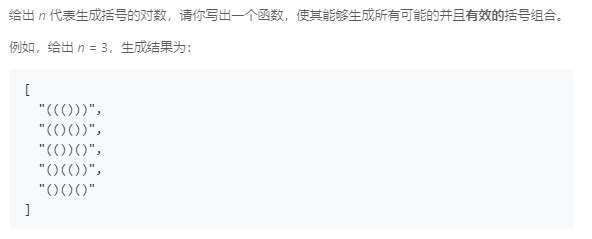

### 22. 括号生成
   
递归回溯，从左至右生成，任一时刻，左括号总数小于等于n，右括号总数小于等于左括号总数。
```java
class Solution {
    private List<String> res = new ArrayList<>();
    public List<String> generateParenthesis(int n) {
        char[] chars = new char[n * 2];
        traceback(0, 0, n, 0, chars);
        return res;
    }

    public void traceback(int leftNum, int rightNum, int n, int k, char[] chars) {
        if (k == n * 2) {
            res.add(String.valueOf(chars));
            return;
        }
        if (leftNum < n) {
            chars[k] = '(';
            traceback(leftNum + 1, rightNum, n, k + 1, chars);
        }
        if (rightNum < n && rightNum < leftNum) {
            chars[k] = ')';
            traceback(leftNum, rightNum + 1, n, k + 1, chars);
        }
    }
}
```