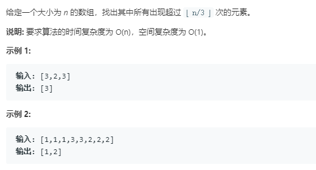

### 229. 求众数 II
   
摩尔投票算法，如果一个数出现次数超过数组长度的1/3，那么从数组中删除任意三个不相同的数之后，那个数出现的次数仍然大于新数组长度的1/3
```java
class Solution {
    public List<Integer> majorityElement(int[] nums) {
        List<Integer> res = new ArrayList<>();
        int x = 0, y = 0, cx = 0, cy = 0;
        for (int num: nums) {
            if (cx > 0 && num == x) {
                cx++;
            } else if (cy > 0 && num == y) {
                cy++;
            } else if (cx == 0) {
                x = num;
                cx++;
            } else if (cy == 0) {
                y = num;
                cy++;
            } else {
                cx--;
                cy--;
            }
        }
        cx =0 ; cy = 0;
        for (int num: nums) {
            if (x == num)
                cx++;
            if (y == num)
                cy++;
        }
        if (cx > nums.length / 3)
            res.add(x);
        if (cy > nums.length / 3 && x != y)
            res.add(y);
        return res;
    }
}
```