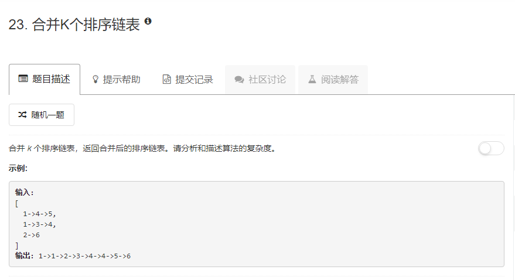

### 23. 合并K个排序链表
   
每个链表的第一个节点都被放到数组lists里，所有节点都合并到第一个链表里。   
在合并过程中，数组lists的每个元素是指向其对应链表的当前待合并节点。   
新建一个节点作为第一个链表的头结点放在第一个链表的头部，然后设一个pre指针指向这个头结点。   
遍历数组lists，寻找最小节点，如果最小节点的下标为0，即在第一个链表，则list[0]指向它的next节点，pre也随之后移，如果最小节点不在第一个链表，则将其下标对应的数组元素的指向后移，并将这个节点插在第一个链表当前节点的前面。   
最后返回最开始新建的头结点的next节点。
```java
/**
 * Definition for singly-linked list.
 * public class ListNode {
 *     int val;
 *     ListNode next;
 *     ListNode(int x) { val = x; }
 * }
 */
class Solution {
    public ListNode mergeKLists(ListNode[] lists) {
        int len = lists.length;
        int i, j;
        if (len == 0) return null;
        if (len == 1) return lists[0];
        ListNode first = new ListNode(Integer.MAX_VALUE);
        first.next = lists[0];
        ListNode pre = first;
        while (true) {
            int idx = 0, min = Integer.MAX_VALUE;
            for (i = 0; i < len; i++) {
                if (lists[i] != null && lists[i].val <= min) {
                    min = lists[i].val; idx = i;
                }
            }
            if (min == Integer.MAX_VALUE) {
                break;
            }
            if (idx == 0) {
                lists[0] = lists[0].next;
                pre = pre.next;
            } else {
                ListNode node = lists[idx];
                lists[idx] = lists[idx].next;
                pre.next = node;
                node.next = lists[0];
                pre = node;
            }
        }
        return first.next;
    }
}
```