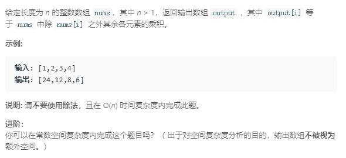

### 238. 除自身以外数组的乘积
   
```java
class Solution {
    public int[] productExceptSelf(int[] nums) {
        int len = nums.length;
        int[] res = new int[len];
        int left = 1, right = 1;
        // left是下标i左侧所有数的乘积
        for (int i = 0; i < len; i++) {
            res[i] = left;
            left *= nums[i];
        }
        // right是下标i右侧所有数的乘积
        for (int i = len - 1; i >= 0; i--) {
            res[i] *= right;
            right *= nums[i];
        }
        return res;
    }
}
```