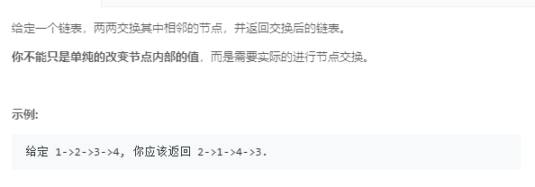

### 24. 两两交换链表中的节点
   
```java
/**
 * Definition for singly-linked list.
 * public class ListNode {
 *     int val;
 *     ListNode next;
 *     ListNode(int x) { val = x; }
 * }
 */
class Solution {
    public ListNode swapPairs(ListNode head) {
        ListNode h = new ListNode(0), p = head, pre = h;
        h.next = head;
        while (p != null && p.next != null) {
            ListNode q = p.next;
            pre.next = q;
            p.next = q.next;
            q.next = p;
            pre = p;
            p = p.next;
        }
        return h.next;
    }
}
```