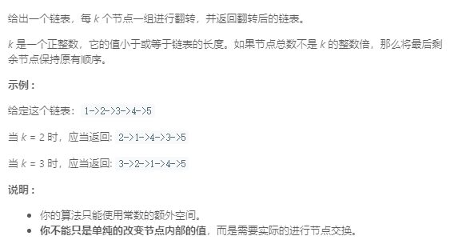

### 25. k个一组翻转链表
   
```java
/**
 * Definition for singly-linked list.
 * public class ListNode {
 *     int val;
 *     ListNode next;
 *     ListNode(int x) { val = x; }
 * }
 */
class Solution {
    public ListNode reverseKGroup(ListNode head, int k) {
        ListNode h = new ListNode(0);
        h.next = head;
        ListNode left = h, right = h;

        while (right != null) {
            int count = 0;
            while (count < k && right != null) {
                count++;
                right = right.next;
            }
            if (count == k && right != null) {
                ListNode tmp = left.next;
                reverse(left, right);
                left = tmp;
                right = left;
            } else {
                return h.next;
            }

        }
        return h.next;
    }
    // 将[left.next, right]区间的链表倒置
    public void reverse(ListNode left, ListNode right) {
        ListNode p = left.next, last = right;
        while (p != right) {
            ListNode q = p.next;
            p.next = right.next;
            right.next = p;
            p = q;
        }
        left.next = right;
    }
}
```