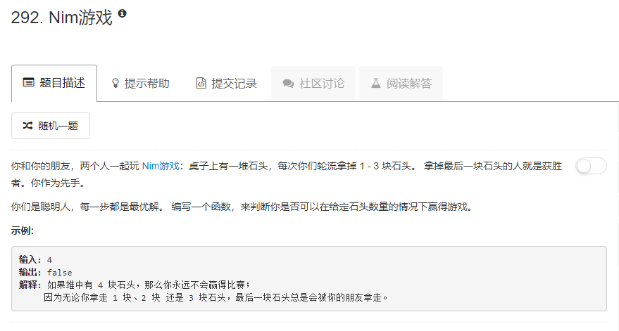

### 292. Nim游戏
  
* `1 <= n <= 3`时，先取的人一次性取完，必赢。
* `n == 4`时，后取的人必赢。
* `n > 4`时：
    * n是4的倍数时，设先取的人第一次取了x个，那么后取的人就可以随之取`4 - x`个，让总数总保持为4的倍数，最后归结为`n == 4`的情况。
    * n不是4的倍数时，先取的人第一次取完后总是可以让总数保持为4的倍数个，这样后取的人就变成了上面n是4的倍数的情况下的先取的人，最后后取的人必输。
综上：n为4的倍数时，先取的人输，其余情况先取的人赢。
```java
class Solution {
    public boolean canWinNim(int n) {
        if (n % 4 == 0) return false;
        return true;
    }
}
```