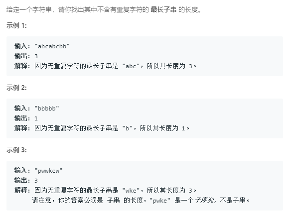

### 3. 无重复字符的最长子串
   
方法一：暴力，对于下标为i的字符，i后面的字符仅能出现一次，时间复杂度O(n^2)
```java
class Solution {
    public int lengthOfLongestSubstring(String s) {
        int[] counts = new int[s.length()];
        int len = s.length();
        for (int i = 0; i < len; i++) {
            int[] hash = new int[200];
            for (int j = i; j < len; j++) {
                char ch = s.charAt(j);
                // j处的字符在i后面是否出现
                if (hash[ch] == 0) {
                    counts[i]++;
                    hash[ch] = 1;
                } else {
                    break;
                }
            }
        }
        int max = Integer.MIN_VALUE;
        for (int i = 0; i < len; i++) {
            if (counts[i] > max) {
                max = counts[i];
            }
        }
        return max;
    }
}
```
方法二：数组`index`记录当前字符上一次出现的下标加1
```java
class Solution {
    public int lengthOfLongestSubstring(String s) {
        int len = s.length();
        int[] index = new int[200];
        int count = 0;
        for (int i = 0, j = 0; j < len; j++) {
            char ch = s.charAt(j);
            // 此时区间左边界应该是i和ch上一次出现位置加1的最大值
            i = Math.max(i, index[ch]);
            count = Math.max(count, j - i + 1);
            index[ch] = j + 1;
        }
        return count;
    }
}
```