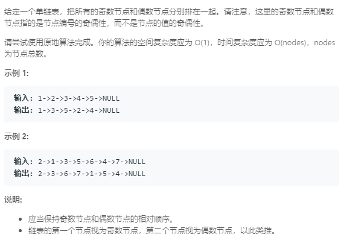

### 328. 奇偶链表
   
```java
/**
 * Definition for singly-linked list.
 * public class ListNode {
 *     int val;
 *     ListNode next;
 *     ListNode(int x) { val = x; }
 * }
 */
class Solution {
    public ListNode oddEvenList(ListNode head) {
        if (head == null || head.next == null) {
            return head;
        }
        ListNode o = head, e = head.next, eh = head.next;
        while (o.next != null && e.next != null) {
            o.next = e.next;
            e.next = o.next.next;
            o = o.next;
            e = e.next;
        }
        o.next = eh;
        return head;
    }
}
```