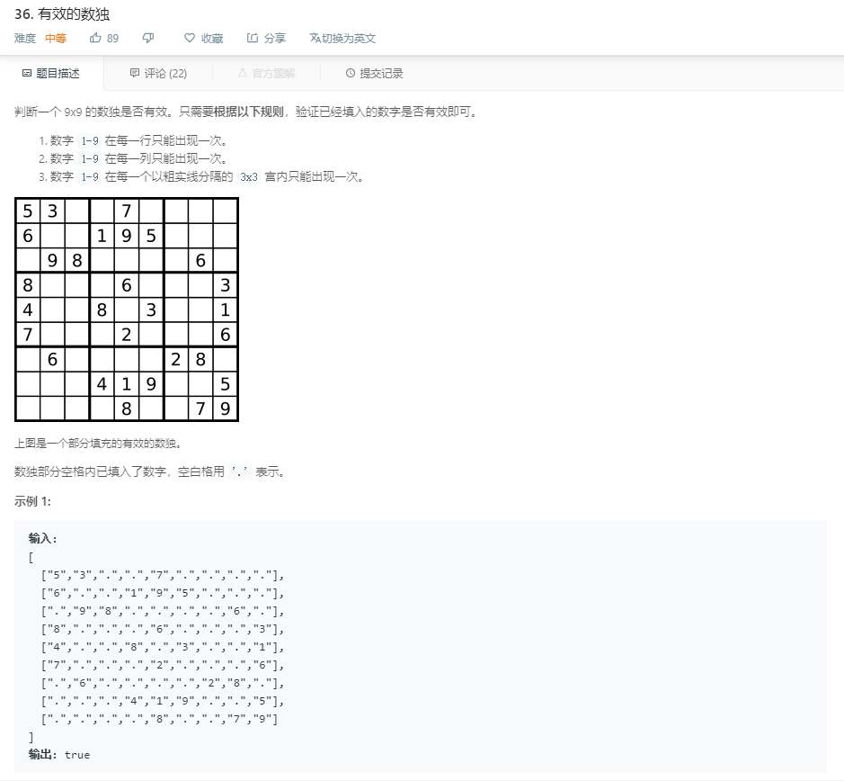

#### 36. 有效的数独
  
```java
class Solution {
    public boolean isValidSudoku(char[][] board) {
        for (int i = 0; i < 9; i++) {
            for (int j = 0; j < 9; j++) {
                char ch = board[i][j];
                if (ch != '.') {
                    for (int k = 0; k < 9; k++) {
                        if ((i != k && board[k][j] == ch) || (k != j && board[i][k] == ch)) {
                            return false;
                        }
                    }
                    int rs = i / 3, cs = j / 3;
                    for (int a = rs * 3; a < rs * 3 + 3; a++) {
                        for (int b = cs * 3; b < cs * 3 + 3; b++) {
                            if (ch == board[a][b] && a != i && b != j) {
                                return false;
                            }
                        }
                    }
                }
            }
        }
        return true;
    }
}
```