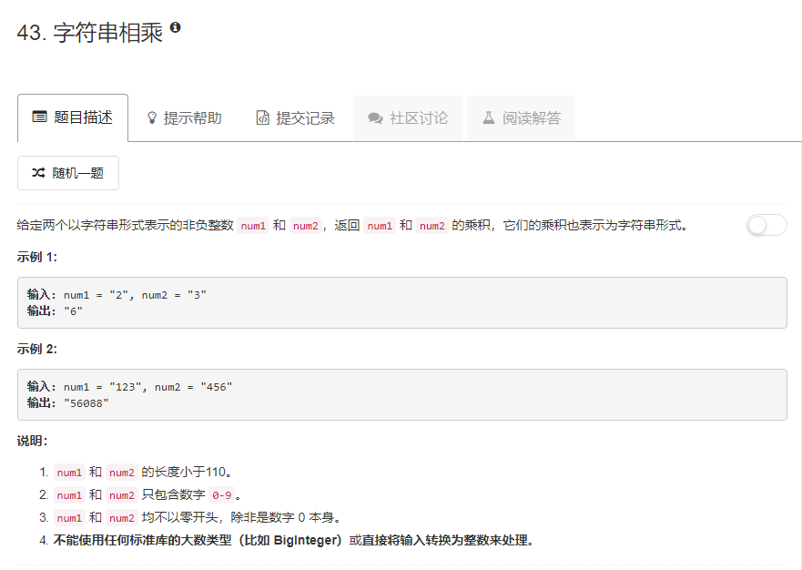

### 43. 字符串相乘
   
直接模拟两数相乘，注意最后判断结果为0的情况。
```java
class Solution {
    public String multiply(String num1, String num2) {
        char[] arr = new StringBuilder(num1).reverse().toString().toCharArray();
        char[] brr = new StringBuilder(num2).reverse().toString().toCharArray();
        int[] res = new int[arr.length + brr.length + 1];
        int i, j;
        for (i = 0; i < arr.length; i++) {
            for (j = 0; j < brr.length; j++) {
                int tmp = (arr[i] - '0') * (brr[j] - '0') + res[i + j];
                res[i + j] = tmp % 10;
                res[i + j + 1] += tmp / 10;
            }
        }
        StringBuilder builder = new StringBuilder();
        i = res.length - 1;
        while (i >= 0 && res[i] == 0) {
            i--;
        }
        if (i < 0) return "0";
        for (; i >= 0; i--) {
            builder.append(res[i]);
        }
        return builder.toString();
    }
}
```