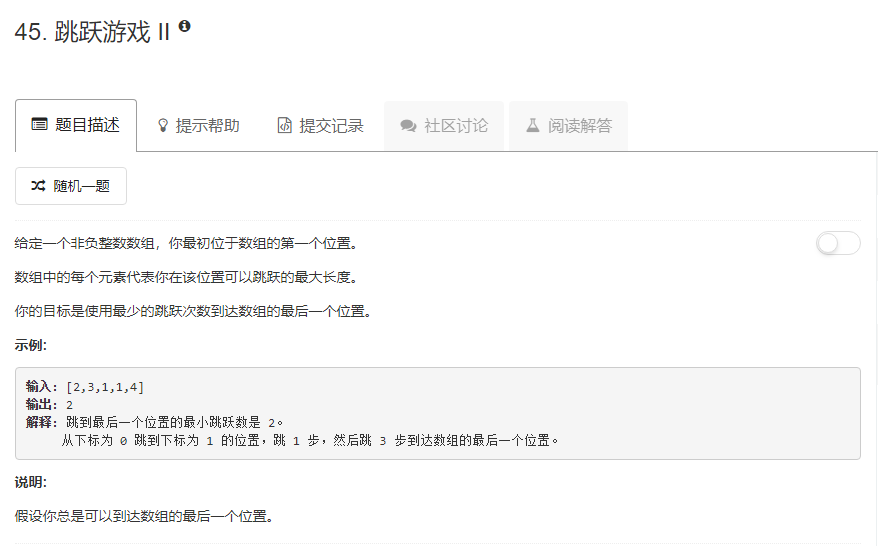

### 45.  跳跃游戏 II
   
第1步是从0开始，最多走nums[0]步，则第2步的起点的选择范围就是`[1, nums[0]]`，在此区间内的i，`i + nums[i]`的最大值为第2步可以到达的最远距离，以此类推下去。。。
```java
class Solution {
    public int jump(int[] nums) {
        int len = nums.length;
        if (len <= 1) {
            return 0;
        }
        if (len == 2) {
            return 1;
        }
        int[] dp = new int[len];
        int count = 1;
        int lastLimit = 0;
        int j = 0;
        while (j < len) {
            int max = lastLimit;
            for (int k = j; k <= lastLimit && k < len; k++) {
                if (k + nums[k] > max) {
                    max = k + nums[k];
                }
            }
            j = lastLimit + 1;
            if (max > lastLimit) {
                for (int k = lastLimit + 1; k <= max && k < len; k++) {
                    dp[k] = count;
                }
                count++;
                lastLimit = max;
            }
        }
        return dp[len - 1];
    }
}
```