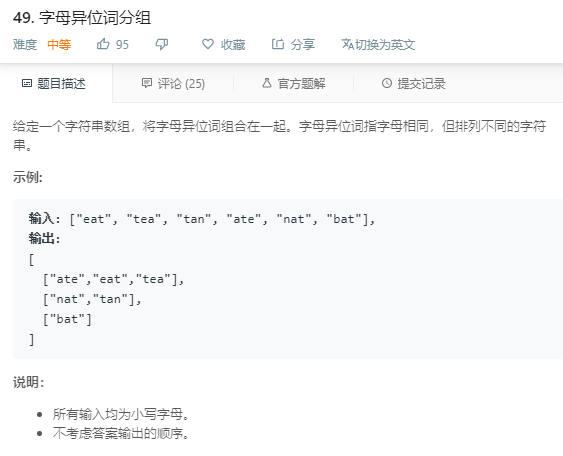

### 49. 字母异位词分组

```java
class Solution {
    public List<List<String>> groupAnagrams(String[] strs) {
        Map<String, List<String>> map = new HashMap<>();
        for (String s : strs) {
            char[] chars = s.toCharArray();
            Arrays.sort(chars);
            String sorted = String.valueOf(chars);
            if (map.get(sorted) == null) {
                List<String> list = new ArrayList<>();
                list.add(s);
                map.put(sorted, list);
            } else {
                map.get(sorted).add(s);
            }
        }
        return new ArrayList<>(map.values());        
    }
}
```