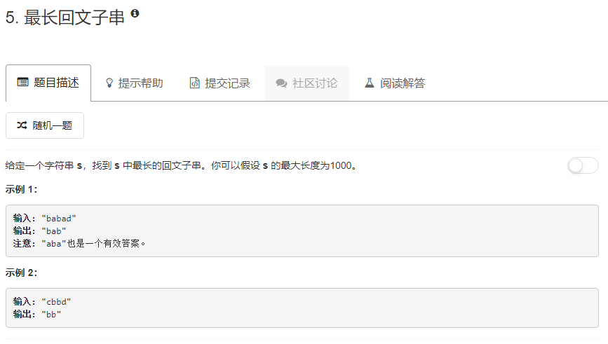

### 5. 最长回文子串
  
动态规划，若下标i与下标j处的字符相等：
1. `j - i <= 2`时从下标i~j子串为回文串，`a`，`aa`，`aba`
2. 下标i+1 ~ j-1的子串为回文串则下标i~j子串为回文串   
从i到j是否为会问子串，取决于i+1到j-1是否为回文子串，也就是，判断i~j时，i+1~j-1应该在此之前已经判断好了，所以下标i应该从大到小遍历。
```java
class Solution {
    public String longestPalindrome(String s) {
        int len = s.length();
        if (len == 0) {
            return "";
        }
        char[] arr = s.toCharArray();
        boolean[][] flag = new boolean[len][len];
        int i, j, max = 0, b = 0, e = 0;
        for (i = len - 1; i >= 0; i--) {
            for (j = i; j < len; j++) {
                if (arr[i] == arr[j] && (j - i <= 2 || flag[i + 1][j - 1])) {
                    flag[i][j] = true;
                    if (max < j - i + 1) {
                        max = j - i + 1;
                        b = i;
                        e = j;
                    }
                }
            }
        }
        return s.substring(b, e + 1);
    }
}
```