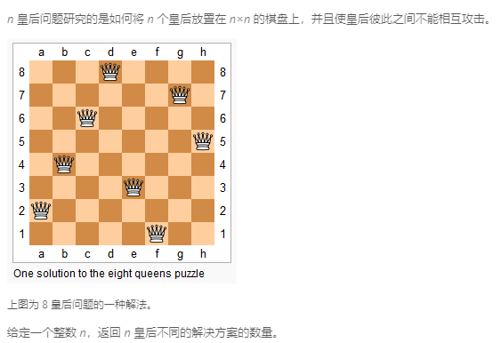

### 52. N皇后 II
   
```java
class Solution {
    private char[][] board;

    private int count = 0;

    public int totalNQueens(int n) {
        board = new char[n][n];
        for (int i = 0; i < n; i++) {
            for (int j = 0; j < n; j++) {
                board[i][j] = '.';
            }
        }
        traceback(0, n);
        return count;
    }

    private boolean judge(int x, int y, int n) {
        for (int i = 0; i < x; i++) {
            for (int j = 0; j < n; j++) {
                if (board[i][j] == 'Q' && (j == y || Math.abs(x - i) == Math.abs(y - j))) {
                    return false;
                }
            }
        }
        return true;
    }

    private void traceback(int k, int n) {
        if (k == n) {
            count++;
            return;
        }
        for (int i = 0; i < n; i++) {
            if (judge(k, i, n)) {
                board[k][i] = 'Q';
                traceback(k + 1, n);
                board[k][i] = '.';
            }
        }
    }
}
```