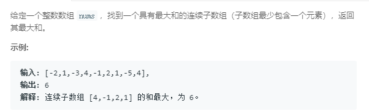

### 53. 最大子序和
    
设dp[n]是以下标n为结尾的最大子序和，则dp[n] = max(dp[n - 1] + nums[n], nums[n])，则最后的结果为max(dp[1 : n])
```java
class Solution {
    public int maxSubArray(int[] nums) {
        int sum = 0, max = Integer.MIN_VALUE;
        for (int num: nums) {
            // 此时sum相当于dp[n - 1]
            if (sum < 0) {
                // dp[n - 1] < 0时，dp[n - 1] + nums[n]一定小于nums[n]
                sum = num;
            } else {
                sum += num;
            }
            // 此时sum相当于dp[n]
            if (sum > max)
                max = sum;
        }
        return max;
    }
}
```