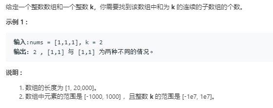

### 560. 和为K的子数组
  
前缀和数组，假设我们令P[i] = A[0] + A[1] + ... + A[i-1]和P[j] = A[0] + A[1] + ... + A[j-1]，那么P[j] - P[i] = A[i] + A[i+1] + ... + A[j-1]。如果P[j] - P[i] == S的话，那么[i,j]就是我们需要的区间。所以我们对于每个j，我们只要计算有多少个i使得P[j] - P[i] == S，这样我们就得到了以P[j]作为右区间并且和为S的区间数。对于A中的每个元素都做同样的处理，最有将所有的结果相加即可。    
这里用map来存放每个P[i]  
```java
class Solution {
    public int subarraySum(int[] nums, int k) {
        if (nums == null || nums.length == 0)
            return 0;
        int sum = 0, count = 0;
        Map<Integer, Integer> map = new HashMap<>();
        map.put(0, 1);
        for (int i = 0; i < nums.length; i++) {
            sum += nums[i];
            if (map.containsKey(sum - k)) {
                count += map.get(sum - k);
            }
            map.put(sum, map.getOrDefault(sum, 0) + 1);
        }
        return count;
    }
}
```