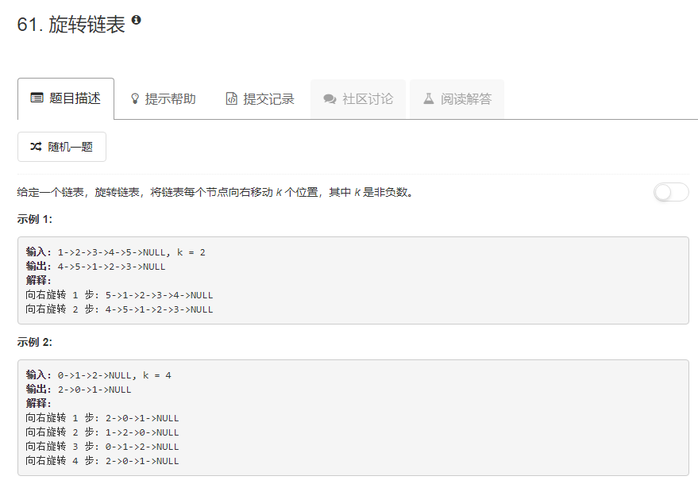

### 61. 旋转链表
    
先遍历链表求节点个数为n，并记录尾节点。  
若链表下标从0开始，则新的链表表头节点下标为`n - k % n`
```java
/**
 * Definition for singly-linked list.
 * public class ListNode {
 *     int val;
 *     ListNode next;
 *     ListNode(int x) { val = x; }
 * }
 */
class Solution {
    public ListNode rotateRight(ListNode head, int k) {
        if (head == null) {
            return null;
        }
        int n = 0;
        ListNode p = head;
        ListNode t = null;
        while (p != null) {
            n++;
            if (p.next == null) {
                t = p;
            }
            p = p.next;
        }
        t.next = head;
        k = n - k % n;
        p = head;
        for (int i = 1; i < k; i++) {
            p = p.next;
        }
        head = p.next;
        p.next = null;
        return head;
    }
}
```