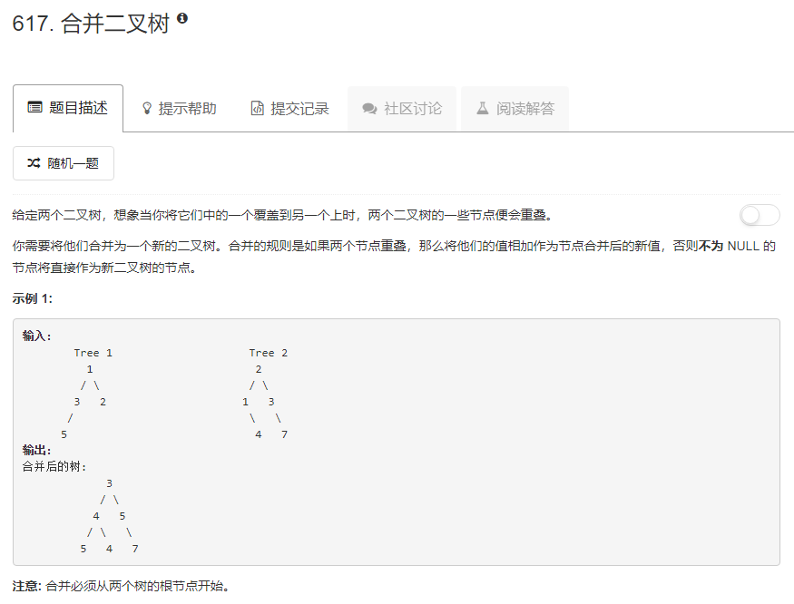

### 617. 合并二叉树
   
明显要用递归，将合并结果放在t1中   
* 如果t1为空，则合并结果就是t2 
* 如果t1不为空  
    * 如果t2为空，则合并结果就是t1
    * 如果t2不为空，则合并结果是将t2的值加到t1上，然后递归求解左右子树的合并结果。  
```java
/**
 * Definition for a binary tree node.
 * public class TreeNode {
 *     int val;
 *     TreeNode left;
 *     TreeNode right;
 *     TreeNode(int x) { val = x; }
 * }
 */
class Solution {
    public TreeNode mergeTrees(TreeNode t1, TreeNode t2) {
        if (t1 == null) {
            return t2;
        } else {
            if (t2 != null) {
                t1.val += t2.val;
                t1.left = mergeTrees(t1.left, t2.left);
                t1.right = mergeTrees(t1.right, t2.right);
            }
            return t1;
        }
    }
}
```