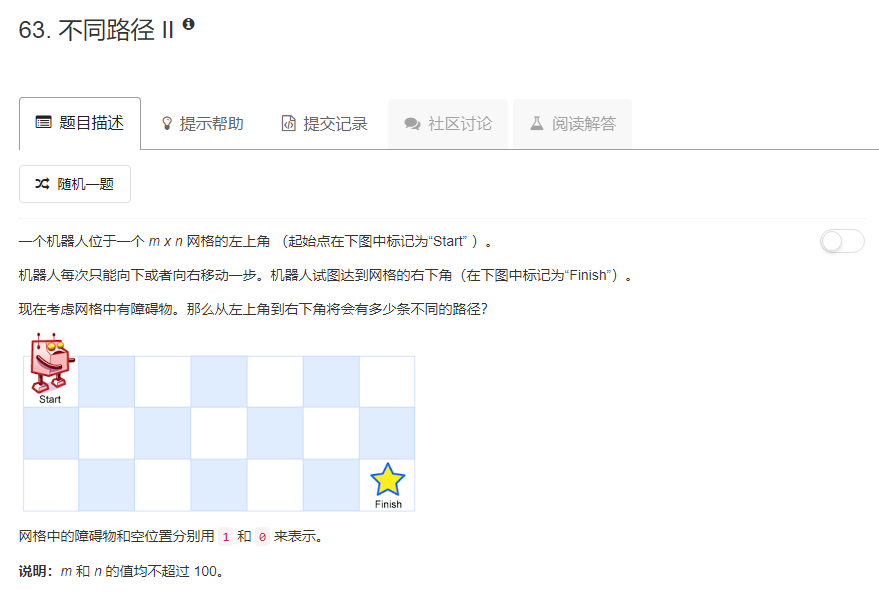

### 63. 不同路径 II
   
* 初始化第一行和第一列格子路径条数时，如果遇到障碍就停止，应为障碍后面的格子无法到达。   
* 其余的格子
    * 如果当前格子为障碍物，路径条数为0
    * 如果左侧为障碍物，路径条数等于上面和它相邻的格子路径条数
    * 如果上面为障碍物，路径条数等于左侧和它相邻的格子路径条数
    * 否则等于左侧加上面。
```java
class Solution {
    public int uniquePathsWithObstacles(int[][] obstacleGrid) {
        int m = obstacleGrid.length;
        int n = obstacleGrid[0].length;
        int[][] dp = new int[m][n];
        int i, j;
        for (i = 0; i < m && obstacleGrid[i][0] != 1; i++) {
            dp[i][0] = 1;
        }
        for (j = 0; j < n && obstacleGrid[0][j] != 1; j++) {
            dp[0][j] = 1;
        }
        for (i = 1; i < m; i++) {
            for (j = 1; j < n; j++) {
                if (obstacleGrid[i][j] == 1) {
                    dp[i][j] = 0;
                    continue;
                }
                dp[i][j] = dp[i - 1][j] + dp[i][j - 1];
                if (obstacleGrid[i - 1][j] == 1) {
                    dp[i][j] -= dp[i - 1][j];
                }
                if (obstacleGrid[i][j - 1] == 1) {
                    dp[i][j] -= dp[i][j - 1];
                }
            }
        }
        return dp[m - 1][n - 1];
    }
}
```