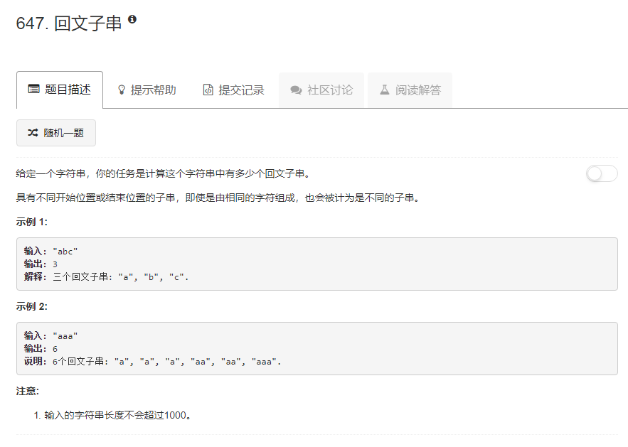

### 647. 回文子串
  
`dp[i][j]`代表从下表i到下表j的子串是否为回文子串   
若`j - i <= 2`，只要i和j处字符相等就是回文子串，例如`a`,`aa`,`aba`   
否则，需要根据`dp[i + 1][j - 1]`来判定，这也是为什么i要从大到小遍历，j要从小到大遍历  
```java
class Solution {
    public int countSubstrings(String s) {
        int len = s.length();
        boolean[][] dp = new boolean[len][len];
        int sum = 0;
        for (int i = len - 1; i >= 0; i--) {
            for (int j = i; j < len; j++) {
                if (s.charAt(i) == s.charAt(j)) {
                    if (j - i <= 2) {
                        dp[i][j] = true;
                        sum++;
                    } else {
                        if (dp[i + 1][j - 1]) {
                            dp[i][j] = true;
                            sum++;
                        } else {
                            dp[i][j] = false;
                        }
                    }
                } else {
                    dp[i][j] = false;
                }
            }
        }
        return sum;
    }
}
```