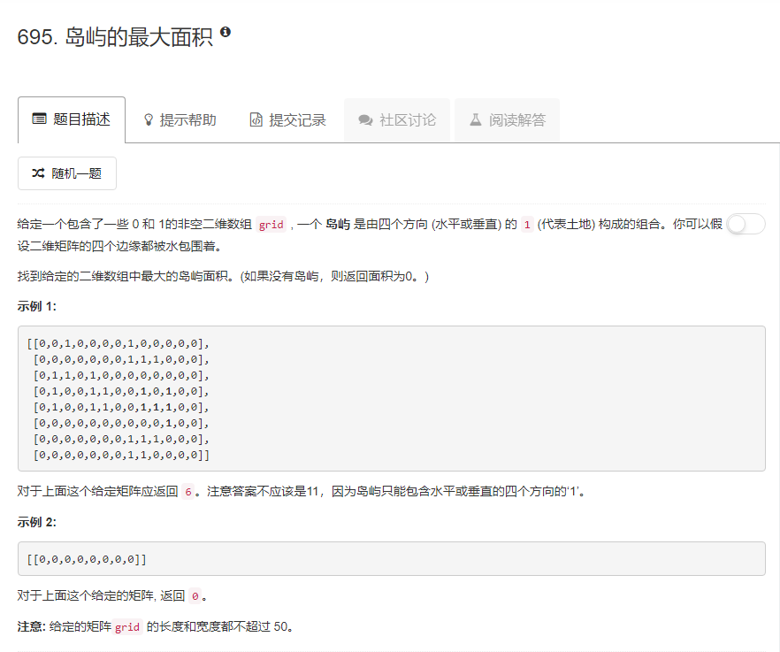

### 695. 岛屿的最大面积
  
深度优先搜索  
```java
class Solution {
    int max = 0;
    int tmp = 0;
    boolean[][] visit;
    public int maxAreaOfIsland(int[][] grid) {
        visit = new boolean[grid.length][grid[0].length];
        for (int i = 0; i < grid.length; i++) {
            for (int j = 0; j < grid[0].length; j++) {
                if (grid[i][j] == 1 && !visit[i][j]) {
                    tmp = 0;
                    dfs(grid, i, j);
                    if (tmp > max) {
                        max = tmp;
                    }
                }
            }
        }
        return max;
    }
    public void dfs(int[][] grid, int i, int j) {
        if (grid[i][j] == 1 && !visit[i][j]) {
            tmp++;
            visit[i][j] = true;
            if (i > 0) dfs(grid, i - 1, j);
            if (i < grid.length - 1) dfs(grid, i + 1, j);
            if (j > 0) dfs(grid, i, j - 1);
            if (j < grid[0].length - 1) dfs(grid, i, j + 1);
        }
    }
}
```