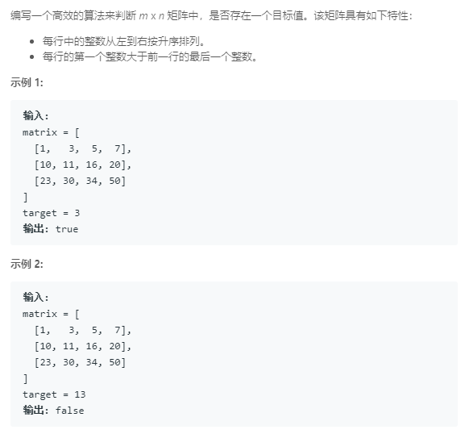

### 74. 搜索二维矩阵
   
将二维数组看成特殊的一维数组，下标做个变换就行，然后二分查找
```java
class Solution {
    private int r, c, count;
    private int[][] arr;

    private int getNum(int idx) {
        int x = idx / c;
        int y = idx % c;
        return arr[x][y];
    }
    
    public boolean searchMatrix(int[][] matrix, int target) {
        r = matrix.length;
        if (r == 0) return false;
        c = matrix[0].length;
        count = r * c;
        arr = matrix;
        int left = 0, right = count - 1;
        while (left <= right) {
            int mid = (left + right) / 2;
            int num = getNum(mid);
            if (num == target) {
                return true;
            }
            if (num < target) {
                left = mid + 1;
            } else {
                right = mid - 1;
            }
        }
        return false;
    }
}
```