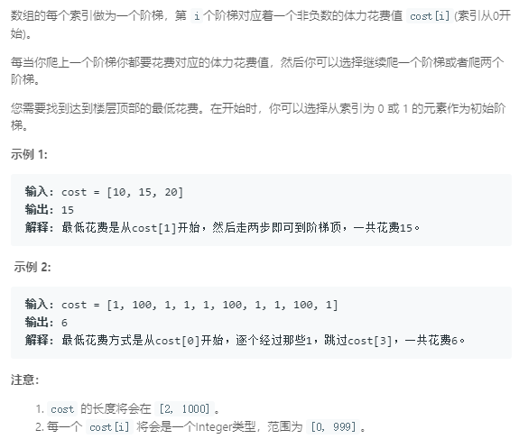

### 746. 使用最小花费爬楼梯
   
到达第i级台阶的最小代价是到i-1级台阶最小代价和到i-2级台阶最小代价的最小值加上第i级台阶的代价
```java
class Solution {
    public int minCostClimbingStairs(int[] cost) {
        int len = cost.length;
        if (len <= 1) {
            return 0;
        }
        int[] dp = new int[len];
        dp[0] = cost[0]; dp[1] = cost[1];
        for (int i = 2; i < len; i++) {
            dp[i] = Math.min(dp[i - 1] + cost[i], dp[i - 2] + cost[i]);
        }
        return Math.min(dp[len - 1], dp[len - 2]);
    }
}
```