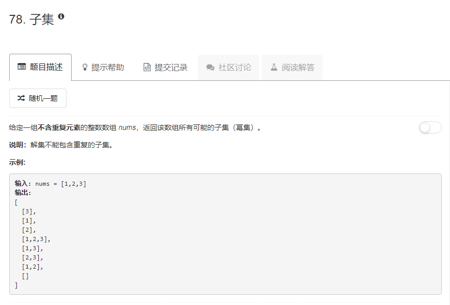

### 78. 子集
   
对于数组的每一个子集，数组中的每一个元素要么在这个子集中，要么不在，只有这两种状态，直接递归   
方法f的参数cur是当前递归对应的数组下标，list是子集，res是存放子集的集合，即最后的结果，当递归到数组末尾时，将子集加入结果，如果不是数组末尾，将当前子集拷贝一份，一个将当前元素加入该子集进行递归，另一个不加当前元素进行递归。 
```java
class Solution {
    public List<List<Integer>> subsets(int[] nums) {
        List<Integer> tmp = new ArrayList<>();
        List<List<Integer>> res = new ArrayList<>();
        f(nums, 0, tmp, res);
        return res;
    }
    
    public void f(int[] nums, int cur, List<Integer> list, List<List<Integer>> res) {
        if (cur == nums.length) {
            res.add(list);
        } else {
            List<Integer> list1 = new ArrayList<>(list);
            list1.add(nums[cur]);
            f(nums, cur + 1, list, res);
            f(nums, cur + 1, list1, res);
        }
    }
}
```