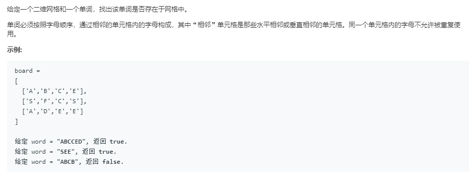

### 79. 单词搜索
    
dfs
```java
class Solution {
    boolean[][] v;
    int rows, cols;
    int[][] dir = {
        {-1, 0},
        {1, 0},
        {0, -1},
        {0, 1}
    };
    
    public boolean exist(char[][] board, String word) {
        if (board.length == 0)
            return false;
        rows = board.length; cols = board[0].length;
        v = new boolean[rows][cols];
        for (int i = 0; i < rows; i++) {
            for (int j = 0; j < cols; j++) {
                if (board[i][j] == word.charAt(0)
                   && search(board, i, j, word, 0))
                    return true;
                v[i][j] = false;
            }
        }
        return false;
    }
    
    public boolean search(char[][] board, int i, int j, String word, int k) {
        if (k == word.length() - 1)
            return true;
        v[i][j] = true;
        for (int h = 0; h < dir.length; h++) {
            int x = i + dir[h][0], y = j + dir[h][1];
            if (x < rows && y < cols && x >= 0 && y >= 0 && !v[x][y] && board[x][y] == word.charAt(k + 1)) {
                if (search(board, x, y, word, k + 1)) {
                    v[x][y] = false;
                    return true; 
                }
                v[x][y] = false;
            }
        }    
        return false;
    }
}
```