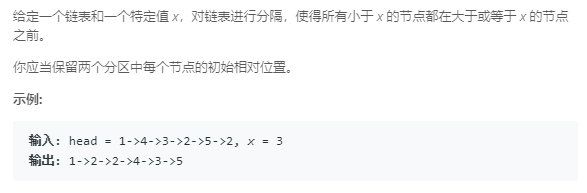

### 86. 分隔链表

```java
/**
 * Definition for singly-linked list.
 * public class ListNode {
 *     int val;
 *     ListNode next;
 *     ListNode(int x) { val = x; }
 * }
 */
class Solution {
    public ListNode partition(ListNode head, int x) {
        ListNode smallHead = null, smallTail = null, bigHead = null, bigTail = null;
        ListNode p = head;
        while (p != null) {
            ListNode q = p.next;
            // 避免形成循环，导致oj超时
            p.next = null;
            if (p.val < x) {
                if (smallHead == null) {
                    smallHead = p;
                } else {
                    smallTail.next = p;
                }
                smallTail = p;
            } else {
                if (bigHead == null) {
                    bigHead = p;
                } else {
                    bigTail.next = p;
                }
                bigTail = p;
            }
            p = q;
        }
        if (smallHead != null) {
            smallTail.next = bigHead;
        } else {
            smallHead = bigHead;
        }
        return smallHead;
    }
}
```