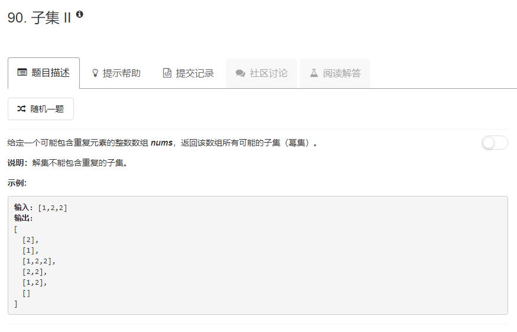

### 90. 子集II
  
和78题思路差不多，只不过递归之前先对数组排个序，然后把每次递归结束获取到的子集加入一个set里，就可以去重了。
```java
class Solution {
    public List<List<Integer>> subsetsWithDup(int[] nums) {
        List<Integer> tmp = new ArrayList<>();
        Set<List<Integer>> res = new HashSet<>();
        Arrays.sort(nums);
        f(nums, 0, tmp, res);
        return new ArrayList<>(res);
    }
    
    public void f(int[] nums, int cur, List<Integer> list, Set<List<Integer>> res) {
        if (cur == nums.length) {
            res.add(list);
        } else {
            List<Integer> list1 = new ArrayList<>(list);
            list1.add(nums[cur]);
            f(nums, cur + 1, list, res);
            f(nums, cur + 1, list1, res);
        }
    }
}
```
