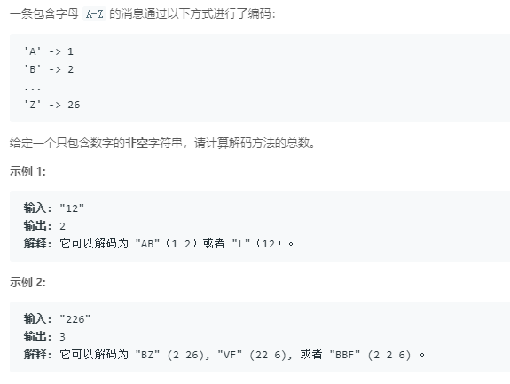

### 91. 解码方法
    
f(n) = f(n - 1) + f(n - 2)，加了几个约束条件：要考虑0，两个连续的0直接返回0，而且还要看0能不能与前面的非0数字结合(大于26就无法表示，返回0)。非0数字前面是否是0，如果不是，和前面的数字结合后是否大于26.
```java
class Solution {
    public int numDecodings(String s) {
        int len = s.length();
        if (len == 0 || s.charAt(0) == '0') {
            return 0;
        }
        int[] dp = new int[len];
        dp[0] = 1;
        char pre = s.charAt(0);
        for (int i = 1; i < len; i++) {
            char ch = s.charAt(i);
            if (ch == '0') {
                if (pre == '0') {
                    return 0;
                } else {
                    if (10 * (pre - '0') > 20) {
                        return 0;
                    } else {
                        if (i == 1)
                            dp[i] = 1;
                        else
                            dp[i] = dp[i - 2];
                    }
                }
            } else {
                if (pre == '0') {
                    dp[i] = dp[i - 1];
                } else {
                    if (10 * (pre - '0') + (ch - '0') <= 26) {
                        if (i == 1) {
                            dp[i] = 2;
                        } else {
                            dp[i] = dp[i - 1] + dp[i - 2];
                        }
                    } else {
                        dp[i] = dp[i - 1];
                    }
                }
            }
            pre = ch;
        }
        return dp[len - 1];
    }
}
```