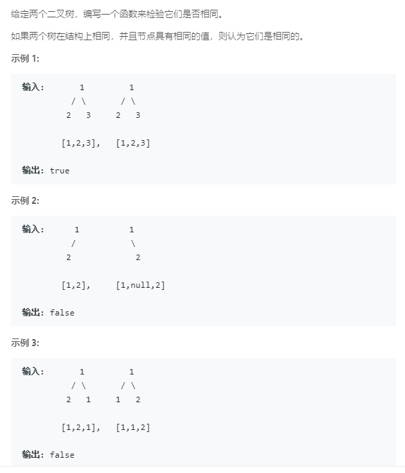

### 100. 相同的树
   
递归，根节点相等且它们的左右子树相同
```java
/**
 * Definition for a binary tree node.
 * public class TreeNode {
 *     int val;
 *     TreeNode left;
 *     TreeNode right;
 *     TreeNode(int x) { val = x; }
 * }
 */
class Solution {
    public boolean isSameTree(TreeNode p, TreeNode q) {
        if (p == null && q == null) {
            return true;
        } else if (p != null && q != null) {
            return p.val == q.val && isSameTree(p.left, q.left) && isSameTree(p.right, q.right);
        } else {
            return false;
        }
    }
}
```