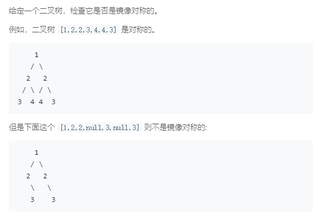

### 101. 对称二叉树
   
选择二叉树的任意一种遍历方式，和其镜像的遍历方式，每次遍历到的节点值应该是相等的。   
比如：中序遍历是先左子树，然后根节点，右子树，其镜像的遍历就是先右子树，然后根节点，左子树
递归：
```java
/**
 * Definition for a binary tree node.
 * public class TreeNode {
 *     int val;
 *     TreeNode left;
 *     TreeNode right;
 *     TreeNode(int x) { val = x; }
 * }
 */
class Solution {
    public boolean isSymmetric(TreeNode root) {
        return root == null || test(root.left, root.right);
    }
    
    public boolean test(TreeNode left, TreeNode right) {
        if (left == null && right == null) {
            return true;
        } else if (left != null && right != null) {
            return left.val == right.val && test(left.right, right.left) && test(left.left, right.right);
        } else {
            return false;
        }
    }
}
```
非递归：
```java
/**
 * Definition for a binary tree node.
 * public class TreeNode {
 *     int val;
 *     TreeNode left;
 *     TreeNode right;
 *     TreeNode(int x) { val = x; }
 * }
 */
class Solution {
    public boolean isSymmetric(TreeNode root) {
        LinkedList<TreeNode> leftStack = new LinkedList<>();
        LinkedList<TreeNode> rightStack = new LinkedList<>();
        TreeNode p = root, q = root;
        while (p != null && q != null) {
            if (p.val != q.val)
                return false;
            leftStack.push(p); rightStack.push(q);
            p = p.left; q = q.right;
        }
        if (p != null || q != null) {
            return false;
        }
        while (!leftStack.isEmpty() && !rightStack.isEmpty()) {
            TreeNode leftCur = leftStack.pop(), rightCur = rightStack.pop();
            if (leftCur.val != rightCur.val) 
                return false;
            if (leftCur.right != null && rightCur.left != null) {
                p = leftCur.right;
                while (p != null) {
                    leftStack.push(p);
                    p = p.left;
                }
                q = rightCur.left;
                while (q != null) {
                    rightStack.push(q);
                    q = q.right;
                }
            } else if (leftCur.right == null && rightCur.left == null) {
                
            } else {
                return false;
            }
        }
        return leftStack.isEmpty() && rightStack.isEmpty();
    }
    
}
```