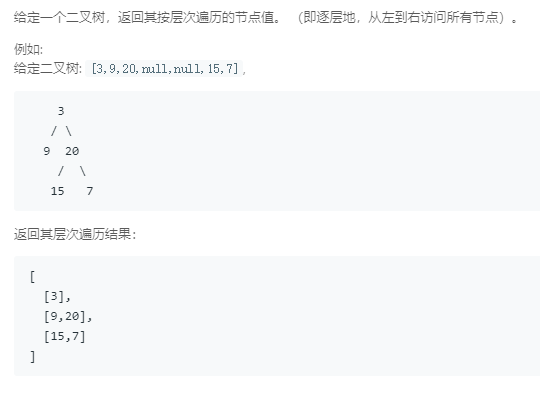

### 102. 二叉树的层次遍历
    
```java
/**
 * Definition for a binary tree node.
 * public class TreeNode {
 *     int val;
 *     TreeNode left;
 *     TreeNode right;
 *     TreeNode(int x) { val = x; }
 * }
 */
class Solution {
    public List<List<Integer>> levelOrder(TreeNode root) {
        List<List<Integer>> res = new ArrayList<>();
        if (root == null) {
            return res;
        }
        TreeNode p = root;
        LinkedList<TreeNode> queue = new LinkedList<>();
        queue.addLast(p);
        int maxSize = 1, size = 0, nextSize = 0;
        List<Integer> tmp = new ArrayList<>(), curList = tmp;
        while (!queue.isEmpty()) {
            TreeNode cur = queue.pollFirst();
            curList.add(cur.val);
            if (cur.left != null) {
                nextSize++;
                queue.addLast(cur.left);
            }
            if (cur.right != null) {
                nextSize++;
                queue.addLast(cur.right);
            }
            size++;
            if (size == maxSize) {
                size = 0;
                maxSize = nextSize;
                nextSize = 0;
                if (curList.size() > 0) {
                    res.add(curList);
                }
                curList = new ArrayList<>();
            }
        }
        return res;
    }
}
```