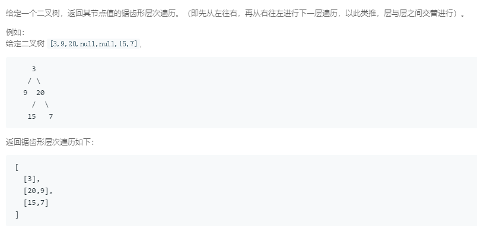

### 103. 二叉树的锯齿形层次遍历
   
```java
/**
 * Definition for a binary tree node.
 * public class TreeNode {
 *     int val;
 *     TreeNode left;
 *     TreeNode right;
 *     TreeNode(int x) { val = x; }
 * }
 */
class Solution {
    public List<List<Integer>> zigzagLevelOrder(TreeNode root) {
        List<List<Integer>> res = new ArrayList<>();
        if (root == null)
            return res;
        LinkedList<TreeNode> queue = new LinkedList<>();
        TreeNode p = root;
        int floor = 0, curSize = 1, nextSize = 0;
        List<Integer> list = new ArrayList<>(1);
        queue.add(p);
        while (!queue.isEmpty()) {
            for (int i = 0; i < curSize; i++) {
                p = queue.pollFirst();
                list.add(p.val);
                if (p.left != null) {
                    nextSize++;
                    queue.addLast(p.left);
                }
                if (p.right != null) {
                    nextSize++;
                    queue.addLast(p.right);
                }
            }
            if ((floor & 1) == 1) {
                Collections.reverse(list);
            }
            floor++;
            res.add(list);
            list = new ArrayList<>(nextSize);
            curSize = nextSize;
            nextSize = 0;
        }
        return res;
    }
}
```