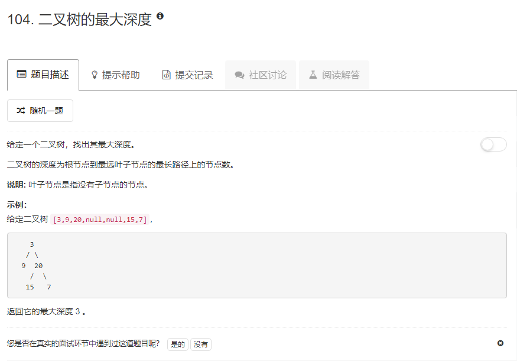

### 104. 二叉树的最大深度
  
递归，返回左右子树高度的最大值加1
```java
/**
 * Definition for a binary tree node.
 * public class TreeNode {
 *     int val;
 *     TreeNode left;
 *     TreeNode right;
 *     TreeNode(int x) { val = x; }
 * }
 */
class Solution {
    public int maxDepth(TreeNode root) {
        if (root == null) {
            return 0;
        }
        int lh = maxDepth(root.left) + 1;
        int rh = maxDepth(root.right) + 1;
        return lh > rh ? lh : rh;
    }
}
```