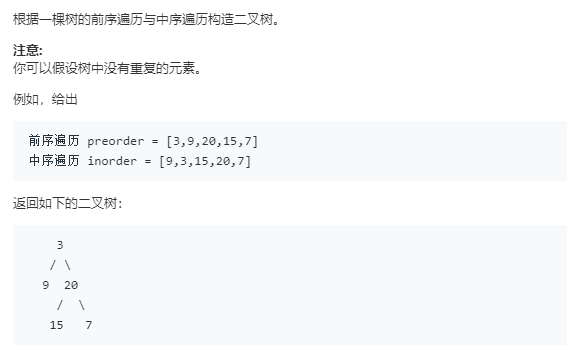

### 105. 从前序与中序遍历序列构造二叉树
    
关键在于每次递归时，前序遍历和中序遍历序列中左子树部分和右子树部分。
```java
/**
 * Definition for a binary tree node.
 * public class TreeNode {
 *     int val;
 *     TreeNode left;
 *     TreeNode right;
 *     TreeNode(int x) { val = x; }
 * }
 */
class Solution {
    public TreeNode buildTree(int[] preorder, int[] inorder) {
        if (preorder.length == 0)
            return null;
        return buildTree(preorder, inorder, 0, preorder.length - 1, 0, inorder.length - 1);
    }
    
    public TreeNode buildTree(int[] pre, int[] in, int ps, int pe, int is, int ie) {
        TreeNode root = new TreeNode(pre[ps]);
        int rootIdx = is;
        for (; rootIdx <= ie && in[rootIdx] != root.val; rootIdx++);
        int leftL = rootIdx - is, rightL = ie - rootIdx;
        if (leftL > 0) {
            root.left = buildTree(pre, in, ps + 1, ps + leftL, is, rootIdx - 1);
        }
        if (rightL > 0) {
            root.right = buildTree(pre, in, ps + leftL + 1, pe, rootIdx + 1,  ie);
        }
        return root;
    }
}
```