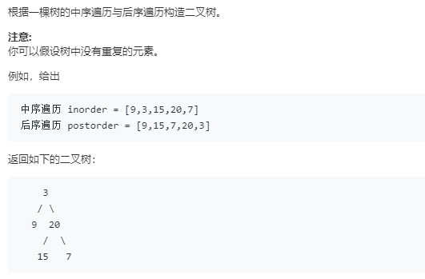

### 106. 从中序与后序遍历序列构造二叉树
    
```java
/**
 * Definition for a binary tree node.
 * public class TreeNode {
 *     int val;
 *     TreeNode left;
 *     TreeNode right;
 *     TreeNode(int x) { val = x; }
 * }
 */
class Solution {
    public TreeNode buildTree(int[] inorder, int[] postorder) {
        int len;
        if ((len = inorder.length) == 0)
            return null;
        return buildTree(inorder, postorder, 0, len - 1, 0, len - 1);
    }
    
    public TreeNode buildTree(int[] in, int[] post, int is, int ie, int ps, int pe) {
        TreeNode root = new TreeNode(post[pe]);
        int rootIdx = is;
        for (; rootIdx <= ie && in[rootIdx] != root.val; rootIdx++);
        int leftL = rootIdx - is, rightL = ie - rootIdx;
        if (leftL > 0) {
            root.left = buildTree(in, post, is, rootIdx - 1, ps, ps + leftL - 1);
        }
        if (rightL > 0) {
            root.right = buildTree(in, post, rootIdx + 1, ie, ps + leftL, pe - 1);
        }
        return root;
    }
}
```