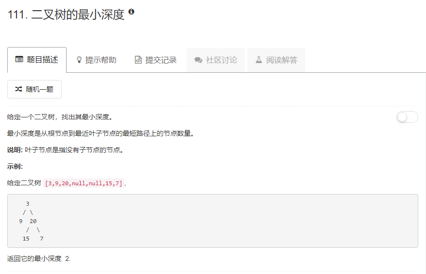

### 111. 二叉树的最小深度
   
当递归到一棵子树时，如果子树为空，深度为0；如果左右子树都为空，深度为1；如果左子树为空右子树不为空，则子树的深度为它的左子树的深度加1,反之亦然。   
因为这是求最小深度，等于左右子树深度的最小值加1，如果直接按照最大深度的方式来求，那么左右子树一个为空，另一个不为空时，为空产生的0就会产生干扰，这时就应该把不为空的子树的深度加1作为当前的深度。
方法一：
```java
/**
 * Definition for a binary tree node.
 * public class TreeNode {
 *     int val;
 *     TreeNode left;
 *     TreeNode right;
 *     TreeNode(int x) { val = x; }
 * }
 */
class Solution {
    public int minDepth(TreeNode root) {
        if (root == null) {
            return 0;
        }
        if (root.left == null && root.right == null) {
            return 1;
        }
        int h;
        if (root.left == null) {
            h = minDepth(root.right) + 1;
        } else if (root.right == null) {
            h = minDepth(root.left) + 1;
        } else {
            int lh = minDepth(root.left) + 1;
            int rh = minDepth(root.right) + 1;
            h = lh < rh ? lh : rh;
        }
        return h;
    }
}
```
方法二：
```java
/**
 * Definition for a binary tree node.
 * public class TreeNode {
 *     int val;
 *     TreeNode left;
 *     TreeNode right;
 *     TreeNode(int x) { val = x; }
 * }
 */
class Solution {
    public int minDepth(TreeNode root) {
        if (root == null) {
            return 0;
        }
        int h;
        int lh = minDepth(root.left) + 1;
        int rh = minDepth(root.right) + 1;
        if (lh == 1 && rh == 1) {
            h = 1;
        } else if (lh == 1 && rh > 1) {
            h = rh;
        } else if(lh > 1 && rh == 1) {
            h = lh;
        } else {
            h = lh < rh ? lh : rh;
        }
        return h;
    }
}
```