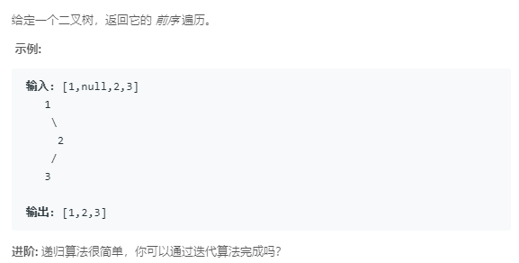

### 144. 二叉树的前序遍历
   
递归：
```java
/**
 * Definition for a binary tree node.
 * public class TreeNode {
 *     int val;
 *     TreeNode left;
 *     TreeNode right;
 *     TreeNode(int x) { val = x; }
 * }
 */
class Solution {
    private List<Integer> res = new ArrayList<>();
    
    public List<Integer> preorderTraversal(TreeNode root) {
        preorder(root);
        return res;
    }
    
    public void preorder(TreeNode root) {
        if (root != null) {
            res.add(root.val);
            preorder(root.left);
            preorder(root.right);
        }
    }
}
```
非递归：
```java
/**
 * Definition for a binary tree node.
 * public class TreeNode {
 *     int val;
 *     TreeNode left;
 *     TreeNode right;
 *     TreeNode(int x) { val = x; }
 * }
 */
class Solution {
    
    public List<Integer> preorderTraversal(TreeNode root) {
        List<Integer> res = new ArrayList<>();
        LinkedList<TreeNode> stack = new LinkedList<>();
        TreeNode p = root;
        while (p != null) {
            res.add(p.val);
            stack.push(p);
            p = p.left;
        }
        while (!stack.isEmpty()) {
            TreeNode cur = stack.pop();
            if (cur.right != null) {
                p = cur.right;
                while (p != null) {
                    res.add(p.val);
                    stack.push(p);
                    p = p.left;
                }
            }
        }
        return res;
    }
}
```