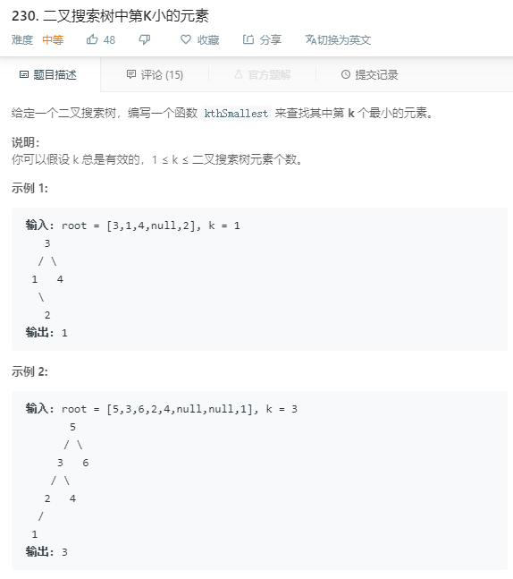

### 230. 二叉搜索树中第K小的元素
    
二叉树中序遍历
```java
/**
 * Definition for a binary tree node.
 * public class TreeNode {
 *     int val;
 *     TreeNode left;
 *     TreeNode right;
 *     TreeNode(int x) { val = x; }
 * }
 */
class Solution {
    private int count = 0;
    private int res;

    private boolean inOrder(TreeNode root, int k) {
        if (root != null) {
            boolean t = inOrder(root.left, k);
            if (t) {
                return true;
            }
            count++;
            if (k == count) {
                res = root.val;
                return true;
            }
            t = inOrder(root.right, k);
            if (t) {
                return true;
            }
        }
        return false;
    }

    public int kthSmallest(TreeNode root, int k) {
        inOrder(root, k);
        return res;
    }
}
```