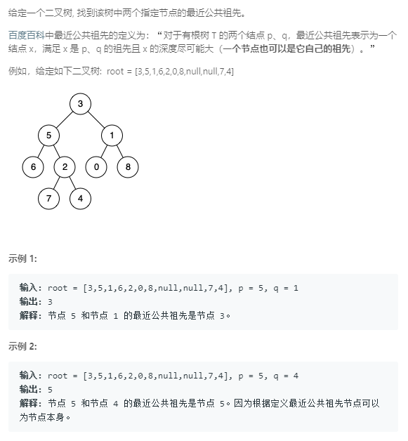

### 236. 二叉树的最近公共祖先
   
从上往下看，如果某个节点是目标节点中的一个，则此节点就是所求结果，否则搜索它的左右子树，如果左右子树均找到，则此节点是结果，如果均为找到，返回null，否则返回左右子树中找到的那个节点。
```java
/**
 * Definition for a binary tree node.
 * public class TreeNode {
 *     int val;
 *     TreeNode left;
 *     TreeNode right;
 *     TreeNode(int x) { val = x; }
 * }
 */
class Solution {
    public TreeNode lowestCommonAncestor(TreeNode root, TreeNode p, TreeNode q) {
        if (root == null) {
            return null;
        }
        boolean f = root.val == p.val || root.val == q.val;
        if (f) {
            return root;
        }
        TreeNode t1 = lowestCommonAncestor(root.left, p, q);
        TreeNode t2 = lowestCommonAncestor(root.right, p, q);
        if (t1 != null && t2 != null) {
            return root;
        } else if (t1 == null && t2 == null) {
            return null;
        } else {
            return t1 != null ? t1 : t2;
        }
    }
}
```