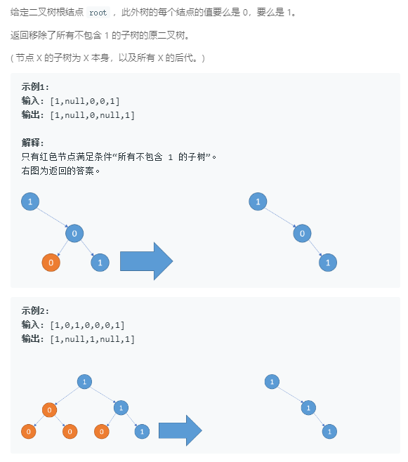

### 814. 二叉树剪枝
   
类似后序遍历，剪完左右子树后再处理根节点。
```java
/**
 * Definition for a binary tree node.
 * public class TreeNode {
 *     int val;
 *     TreeNode left;
 *     TreeNode right;
 *     TreeNode(int x) { val = x; }
 * }
 */
class Solution {
    public TreeNode pruneTree(TreeNode root) {
        if (root == null) {
            return null;
        }
        TreeNode left = pruneTree(root.left), right = pruneTree(root.right);
        if (root.val == 1) {
            root.left = left; root.right = right;
            return root;
        } else {
            if (left == null && right == null) {
                return null;
            } else {
                root.left = left; root.right = right;
                return root;
            }
        }
    }
}
```