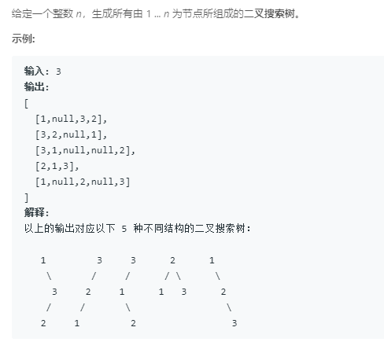

### 95. 不同的二叉搜索树 II
    
和上题同理，1~n分别作为根，递归生成
```java
/**
 * Definition for a binary tree node.
 * public class TreeNode {
 *     int val;
 *     TreeNode left;
 *     TreeNode right;
 *     TreeNode(int x) { val = x; }
 * }
 */
class Solution {
    public List<TreeNode> generateTrees(int n) {
        if (n == 0)
            return new ArrayList<>();
        return gen(1, n);
    }
    
    public List<TreeNode> gen(int start, int end) {
        List<TreeNode> res = new ArrayList<>();
        if (start > end) {
            res.add(null);
            return res;
        }
        for (int i = start; i <= end; i++) {
            List<TreeNode> left = gen(start, i - 1), right = gen(i + 1, end);
            for (TreeNode l: left) {
                for (TreeNode r: right) {
                    TreeNode root = new TreeNode(i);
                    root.left = l; root.right = r;
                    res.add(root);
                }
            }
        }
        return res;
    }
}
```