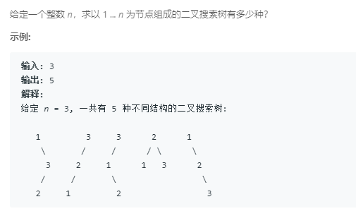
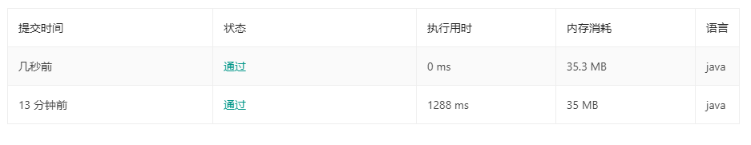

### 96. 不同的二叉搜索树
   
从1~n，每个数字依次作为根节点，当i作为根节点时，数目为`f(i - 1) * f(n - i)`，所以总和为`f(0)*f(n) + f(1)*f(n-1) + ... + f(n-1)*f(1) + f(n)*f(0)`，所以就有了下面这个代码：
```java
class Solution {
    public int numTrees(int n) {
        if (n == 0 || n == 1)
            return 1;
        else if (n == 2) 
            return 2;
        else {
            int s = 0;
            for (int i = 1; i <= n; i++) {
                s += numTrees(i - 1) * numTrees(n - i);
            }
            return s;
        }
    }
}
```
这个虽然能通过但很明显直接递归是很慢的，而且这里还有大量重复递归。。。。     
用数组改进：
```java
class Solution {
    
    public int numTrees(int n) {
        if (n == 0 || n == 1)
            return 1;
        else if (n == 2) 
            return 2;        
        int[] dp = new int[n + 1];
        dp[0] = 1; dp[1] = 1; dp[2] = 2;
        for (int i = 3; i <= n; i++) {
            for (int j = 1; j <= i; j++) {
                dp[i] += dp[j - 1] * dp[i - j];
            }
        }
        return dp[n];
    }

}
```
递归与非递归版本的执行时间差距。。。   
