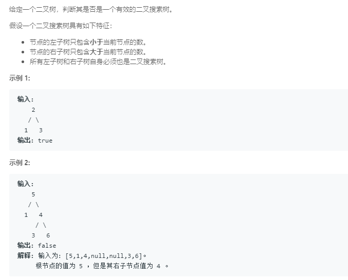

### 98. 验证二叉搜索树
   
二叉搜索树中序遍历序列应该是一个递增的序列，但题目测试数据卡了`Integer.MIN_VALUE`这个边界值，所以我改成`long`了        
```java
/**
 * Definition for a binary tree node.
 * public class TreeNode {
 *     int val;
 *     TreeNode left;
 *     TreeNode right;
 *     TreeNode(int x) { val = x; }
 * }
 */
class Solution {
    private long pre = Long.MIN_VALUE;
    
    public boolean isValidBST(TreeNode root) {
        if (root == null)
            return true;
        else {
            boolean f1 = isValidBST(root.left);
            long cur = (long) root.val;
            if (pre >= cur)
                return false;
            pre = cur;
            boolean f2 = isValidBST(root.right);
            return f1 && f2;
        }
    }
}
```