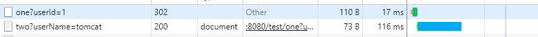
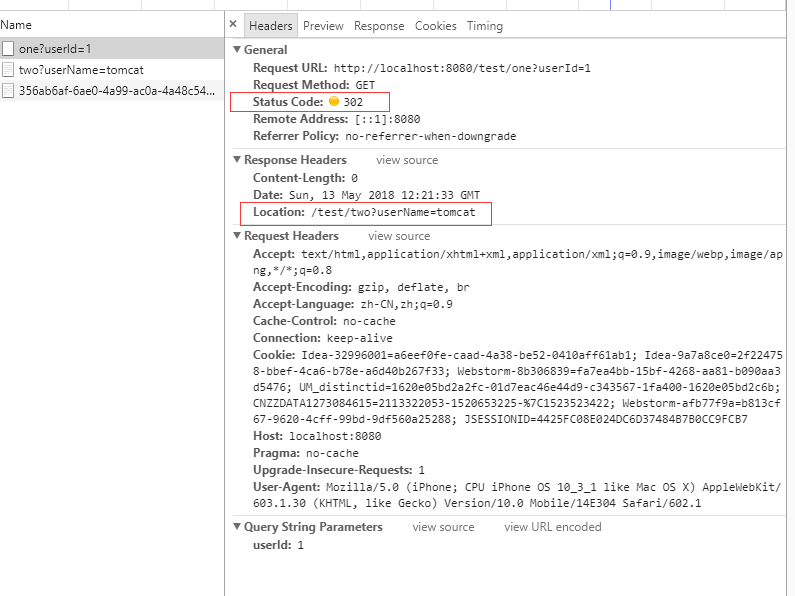

### HttpServletResponse
#### 一.
&emsp;&emsp;Servlet程序通过调用ServletResponse对象中的方法可以向客户端回送基本的响应消息，HttpServletResponse是专用于HTTP协议的ServletResponse子接口，它用于封装HTTP消息，允许操控HTTP协议相关数据，包括响应头和状态码，支持cookie和session跟踪，HTTPServletResponse也定义了一系列用于描述各种HTTP状态码的常量。HttpServletResponse是Servlet规范中定义的接口，具体实现由Servlet容器实现。
#### 二. 产生响应状态行
1. 状态码常量  
HttpServletResponse中定义了若干与状态码数值对应的常量，每个常量的名称以前缀SC开头，然后是状态码在Http规范中所表示的状态信息的应为单词的组合，如404是Not Found，在HttpServletResponse中定义的常量名称是`SC_NO_CONTENT`。
2. `setStatus`方法  
setStatus方法用于设置HTTP响应消息的状态码，并生成响应状态行，正常情况下的响应码是200，web服务器默认自动生成这种正常状态下的响应状态行，因此通常情况下不需要调用该方法，只有在生成特殊状态码时才需要调用该方法。
3. `sendError`方法  
用于发送表示错误信息的状态码（比如404）到客户端，并清除缓冲区中的内容，HttpServletResponse中提供了两个重载的sendError方法：  
`public void sendError(int code) throws IOException;`  
`public void sendError(int code, String message) throws IOException;`  
第二个除了可以发送错误信息的状态码，还可以在响应消息的正文内容中加入一条用于提示说明的文本信息。 

#### 三. 构建响应头常用方法
1. `addHeader` 与 `setHeader`方法
`public void addHeader(String name, String value);`  
`public void setHeader(String name, String value);`  
这两个方法都是增加一个新的头字段，如果已经设置过同名的头字段，setHeader将用新设置的值取代原来设置的值，而addHeader则是增加一个同名的头字段。
2. `addIntHeader` 与 `setIntHeader`：专门用于设置包含整数值的响应头的方法。
3. `addDateHeader` 与 `setDateHeader`：专门用于设置包含日期值的响应头的方法，避免了把时间转换为GMT时间串的麻烦。
4. `setContentLength` 方法  
设置Content-Length响应头字段，一般来说，在没有采用chunked传输编码方式时Servlet会自动设置该字段。
5. `setContentTyp`e方法  
设置Servlet输出内容的MIME类型，Servlet默认的是`text/plain`，即普通的文本类型。在MIME类型后面还可以指定响应内容所采用的字符集类型，如`response.setContentType("text/html;charset=UTF-8");` ，这同时也指定了ServletResponse.getWriter方法返回的PrinterWriter对象输出文本时所采用的字符集编码。
6. `setCharacterEncoding`方法  
用于设置输出内容的MIME声明中的字符集编码，对HTTP协议来说，就是设置Content-Type头字段中的字符集编码部分。如果没有设置Content-Type头字段，该方法设置的字符集编码不会出现在Http消息的响应头中，但是它的设置仍决定了PrinterWriter对象输出文本时采用的字符集编码。
7. `setLocale`方法：设置响应消息的本地化信息。
8. `containsHeader`方法，用于检查某个名称的头字段是否已被设置。

#### 四. 创建响应正文
1. `getOutputStream`方法用于返回ServletOutputStream对象，用于输出字节流，`getWriter`方法用于返回PrinterWriter对象，用于输出字符流，对同一个ServletResponse对象来说，这两个方法互斥，调用了其中一个就不能调用另一个，否则会抛异常。这两个对象输出的数据会被Servlet容器当作响应消息的正文，与响应状态行和响应头组合后输出到客户端。
2. 在Servlet的service方法调用结束后，容器会检查ServletOutputStream或PrinterWriter对象是否已经调用close方法，如果没关闭，则容器会调用close方法关闭输出流，但在写代码时应该总是自己调用close方法来及时释放资源。
3. 对于同一个ServletResponse对象，多次调用getWriter方法返回的是同一个PrinterWriter对象的引用，通过这些引用变量写入的数据将按照调用的顺序写入到同一输出流中。getOutputStream方法也是如此。
4. Servlet程序输出的HTTP消息的响应正文不是直接发送到客户端，而是先被写入到Servlet容器提供的一个缓冲区里，知道缓冲区被填满或者已经写入所有的响应消息，缓冲区中的内容才会被Servlet容器发送到客户端，针对后者，还会自动设置Content-Length头字段，而前者将采用chunked编码方式传输响应内容。ServletResponse中定义了若干与缓冲区有关的方法：    
    * `setBufferSize`方法，设置期望的输出缓冲区大小，实际使用的缓冲区大小不一定等于该值，但绝对不会小于它。
    * `getBufferSize`方法，返回实际使用的缓冲区的大小。
    * `flushBuffer`方法，将输出缓冲区内容强制输出到客户端。
    * `reset`方法，清空输出缓冲区中的内容（将缓冲区中的内容作废后腾出缓冲区空间），以及设置的响应状态码和各个响应头，如果当前响应已经向客户端输出过部分内容，则会抛出IllegalStateException异常。

#### 五. 请求重定向与请求转发
1. `RequestDispatcher`接口
RequestDispatcher实例对象由Servlet容器创建，用于包装一个要被其他资源调用的资源，并可以通过其中的方法将客户端的请求转发给所包装的资源。  
`ServletContext`接口中定义了获取RequestDispatcher对象的方法：  
`getRequestDispatcher`方法，返回包装了某个路径所指定的资源的RequestDispatcher对象，传递给该方法的路径必须以`/`开头，代表web应用根目录。   
`getNamedDispatcher`方法，返回包装了某个Servlet或JSP文件的RequestDispatcher对象，传递给该方法的参数是`web.xml`中为Servlet或JSP指定的友好名称。  
    1. `include`方法：用于将RequestDispatcher对象所包装的资源内容作为当前响应内容的一部分包含进来，被包含的Servlet里面无法改变响应消息的状态码和响应头，且Servlet容器不会去调整HttpServletRequ对象中的信息，HttpServletRequest对象仍保持其初始的URL路径和参数信息。  
    2. `forward`方法： 用于将请求转发到RequestDispatcher对象所包装的资源。  
        * 如果在调用forward方法之前，在Servlet中写入的内容已经有部分被传到的客户端，则会抛出IllegalStateException异常。
        * 调用forward方法时，Servlet容器将根据目标资源路径对当前的HttpServletRequest对象中的请求路径和参数信息进行调整。
        * 如果在调用forward方法之前已经向输出缓冲区写入了部分内容，只要写入部分没有被传输到客户端，forward方法就可以正常执行，但原来写入到缓冲区的内容将会被清空。在调用forward方法后，如果调用者程序继续向缓冲区写入内容，则会被忽略。
        * 在调用者程序和被调用者程序中对响应状态码和响应头的设置都不会被忽略。这一点与`include`方法不同。
        * 相对路径问题，如果被调用者输出内容中包含使用相对路径的资源时，响应内容中的相对路径都会变为相对调用者的访问URL为基准进行计算。   
    
2. `sendRedirect`方法实现请求重定向
`sendRedirect`方法会向浏览器返回一302响应码和`Location`响应头，然后浏览器会自动向`Location`响应头中的url再次发起请求。如果传递给该方法的参数不是以`/`开头，则表示的是相对于当前请求的URL，如果以`/`开头，则表示的是相对于整个web站点的根目录，而不是相对于当前web应用程序的根目录。该方法对调用者向缓冲区写入的内容处理同RequestDispatcher。

> RequestDispatcher在浏览器地址栏表现为一直保持调用者的URL，而使用sendRedirect方法时，浏览器地址栏中的地址会变为重定向的url。  

```java
public class ServletOne extends HttpServlet {
    protected void doPost(HttpServletRequest request, HttpServletResponse response) throws ServletException, IOException {

    }

    protected void doGet(HttpServletRequest request, HttpServletResponse response) throws ServletException, IOException {
        System.out.println("In ServletOne");
        System.out.println(request.getRequestURI());
        System.out.println(request.getQueryString());
        RequestDispatcher dispatcher = getServletContext().getRequestDispatcher("/test/two?userName=tomcat");
        dispatcher.include(request, response);
    }
}

public class ServletTwo extends HttpServlet {
    protected void doPost(HttpServletRequest request, HttpServletResponse response) throws ServletException, IOException {

    }

    protected void doGet(HttpServletRequest request, HttpServletResponse response) throws ServletException, IOException {
        System.out.println("In ServletTwo");
        System.out.println(request.getRequestURI());
        System.out.println(request.getQueryString());
    }
}
```
访问`http://localhost:8080/test/one?userId=1`，控制台输出：
```txt
In ServletOne
/test/one
userId=1
In ServletTwo
/test/one
userId=1
```

将ServletOne中的include修改为forward方法，再次访问上面的路径，控制台输出：
```txt
In ServletOne
/test/one
userId=1
In ServletTwo
/test/two
userName=tomcat
```
可以看到调用forward方法，会修改HttpServletRequest对象中的信息，但无论是include还是forward，浏览器地址栏中的地址一直保持`http://localhost:8080/test/one?userId=1`不变。

修改ServletOne：
```java
public class ServletOne extends HttpServlet {
    protected void doPost(HttpServletRequest request, HttpServletResponse response) throws ServletException, IOException {

    }

    protected void doGet(HttpServletRequest request, HttpServletResponse response) throws ServletException, IOException {
        System.out.println("In ServletOne");
        System.out.println(request.getRequestURI());
        System.out.println(request.getQueryString());
//        RequestDispatcher dispatcher = getServletContext().getRequestDispatcher("/test/two?userName=tomcat");
//        dispatcher.forward(request, response);
        response.sendRedirect("/test/two?userName=tomcat");
    }
}
```

再次访问上面的路径，可以看到第一次访问的url响应了一个302状态码，然后浏览器又向Location头字段中的url发起请求，同时浏览器地址栏中的地址变为`http://localhost:8080/test/two?userName=tomcat`


