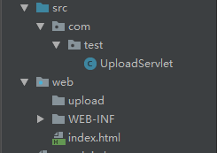
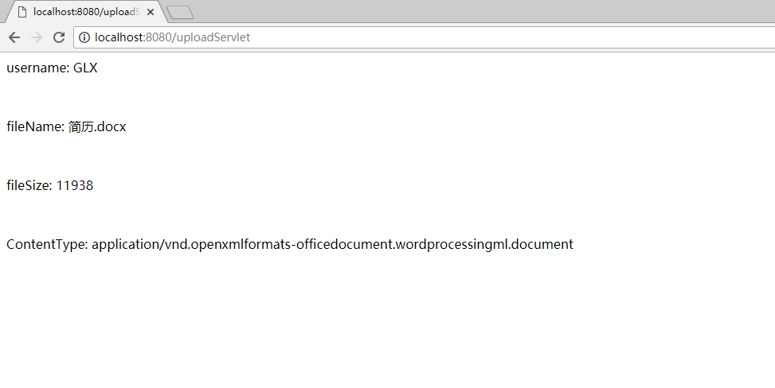

### Servlet3.0的上传文件组件    
   

```java
package com.test;

import javax.servlet.ServletException;
import javax.servlet.annotation.MultipartConfig;
import javax.servlet.annotation.WebServlet;
import javax.servlet.http.HttpServlet;
import javax.servlet.http.HttpServletRequest;
import javax.servlet.http.HttpServletResponse;
import javax.servlet.http.Part;
import java.io.IOException;
import java.io.PrintWriter;

@WebServlet(name = "UploadServlet", urlPatterns = "/uploadServlet")
// 该注解开启上传文件支持
@MultipartConfig
public class UploadServlet extends HttpServlet {
    protected void doPost(HttpServletRequest request, HttpServletResponse response) throws ServletException, IOException {
        request.setCharacterEncoding("utf-8");
        response.setContentType("text/html;charset=utf-8");
        String name = request.getParameter("username");
        Part part = request.getPart("resume");
        String path = getServletContext().getRealPath("")+ "\\upload\\";
        System.out.println(path);
        String fileName = part.getSubmittedFileName();
        part.write(path + fileName);
        PrintWriter writer = response.getWriter();
        writer.println("<p>username: " + name + "</p><br/>");
        writer.println("<p>fileName: " + fileName + "</p><br/>");
        writer.println("<p>fileSize: " + part.getSize() + "</p><br/>");
        writer.println("<p>ContentType: " + part.getContentType() + "</p><br/>");

        writer.close();

    }

    protected void doGet(HttpServletRequest request, HttpServletResponse response) throws ServletException, IOException {

    }
}
```

```html
<!doctype html>
<html lang="en">
<head>
    <meta charset="UTF-8">
    <meta name="viewport"
          content="width=device-width, user-scalable=no, initial-scale=1.0, maximum-scale=1.0, minimum-scale=1.0">
    <meta http-equiv="X-UA-Compatible" content="ie=edge">
    <title>Document</title>
</head>
<body>
<form action="/uploadServlet" method="post" enctype="multipart/form-data">
    用户名：<input type="text" name="username"><br/>
    简 历：<input type="file" name="resume">
    <input type="submit" value="提交">
</form>
</body>
</html>
```
运行效果：   
    

* 上传文件的表单必须`method="post" enctype="multipart/form-data"`（enctype默认值为`application/x-www-form-urlencoded`）；
* `@MultipartConfig`注解开启上传文件支持，此时便可像提交普通表单一样使用`request.getParameter()`方法获取表单中的参数。
* 利用表单中文件类型的input标签的name属性从request中获取Part对象   

Part接口：
```java
package javax.servlet.http;

import java.io.IOException;
import java.io.InputStream;
import java.util.Collection;

public interface Part {
    InputStream getInputStream() throws IOException;

    String getContentType();

    String getName();

    String getSubmittedFileName();

    long getSize();

    void write(String var1) throws IOException;

    void delete() throws IOException;

    String getHeader(String var1);

    Collection<String> getHeaders(String var1);

    Collection<String> getHeaderNames();
}

```