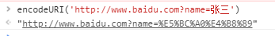
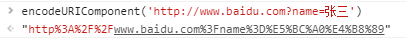
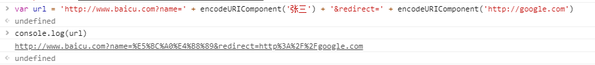

### URL编码与解码
#### 一. 
```html
<meta charset="UTF-8">
```
charset 属性规定 HTML 文档的字符编码，浏览器在显式网页文档时使用该字符集编码来显示其中内容。
```html
<meta http-equiv="Content-Type" content="text/html; charset=UTF-8">
```
这是以前的写法
#### 二. FORM表单从浏览器传输到服务器的过程。
1. 浏览器对FORM表单中输入的特殊字符（如中文字符）会先进行URL编码，再传送给服务器，_编码采用的字符集就是显示页面时采用的字符集编码，即`charset`属性中规定的_。
2. web服务器接收到客户端传递的整个参数信息后，从中分离出每个参数的名称和值部分。
3. 对单个的名称和值部分进行URL解码。
4. 将URL解码得到的字节数组按照某种字符集编码转换成Unicode字符串。
#### 三. getCharacterEncoding方法
该方法返回请求消息中的实体内容的字符集编码的名称，_通常是从`Content-Type`头字段提取的_，如果请求消息中没有指定实体内容的字符集编码名称，则返回null。   
上面提到的服务器进行URL解码所采用的字符集编码方案就是通过这个方法得到的字符集编码。
#### 四. setCharacterEncoding方法
该方法用于覆盖请求消息中的实体内容的字符集编码名称的设置。getParameter和getReader方法将读取到的实体内容从字节数组形态转换成字符串返回时，都要参照请求消息实体内容的字符集编码名称，所以，该方法应早于getParameter方法或getReader方法之前进行调用。
#### 五. getParameter方法的中文问题
getParameter方法既可以获取请求行后面的参数，也可以获取请求消息实体内容的参数。
1. 对于HTTP请求消息的请求行中的URL地址后的参数，getParameter等方法进行URL解码时采用的字符集编码在Servlet规范中没有明确规定，由Servlet容器决定，Tomcat8采用`UTF-8`，因此可以返回正确的中文参数信息，在8之前采用的是`ISO8859-1`，因此无法返回正确的中文参数信息，可以修改server.xml中的`<Connector port="8080" protocol="HTTP/1.1" connectionTimeout="20000" redirectPort="8443" />`，添加`URIEncoding="UTF-8"`。
2. `setParameterEncoding`方法设置请求消息中的实体内容的字符集编码名称，只影响getParameter方法对POST方式下的`application/x-www-form-urlencoded`编码格式的实体内容进行URL解码的结果，而不能影响getParameter方法对HTTP请求消息的请求行中的URL地址后面的参数进行URL解码的结果。
#### 六. js中URL编码的方法
1. encodeURI()方法：对整个URL编码    



2. encodeURIComponent()方法：用于对URL的组成部分进行个别编码，而不用于对整个URL编码，因为同encodeURI()方法相比，它更彻底：

  

可以看到它将URL中的`://`部分一起编码了

