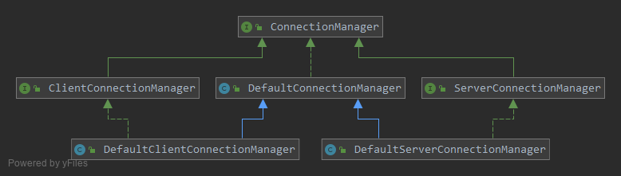

### ConnectionManager

   

`ConnectionManager`接口主要用来管理连接：
* 通过工厂创建`Connection`对象
* 通过注入的选择策略对连接进行选择
* 管理创建和添加的`Connection`对象和`ConnectionPool`连接池对象（包括检查`Connection`对象、维护`ConnectionPool`的健壮性）
* 控制`Connection`对象的心跳打开与关闭

```java
public class DefaultConnectionManager extends AbstractLifeCycle implements ConnectionManager, ConnectionHeartbeatManager, Scannable, LifeCycle {

    // 异步创建连接的线程池
    private ThreadPoolExecutor asyncCreateConnectionExecutor;

    // 配置开关
    private GlobalSwitch globalSwitch;

    // 连接池初始化任务
    protected ConcurrentHashMap<String, RunStateRecordedFutureTask<ConnectionPool>> connTasks;

    /**
     * heal connection tasks
     */
    protected ConcurrentHashMap<String, FutureTask<Integer>> healTasks;

    // 连接池选择策略
    protected ConnectionSelectStrategy connectionSelectStrategy;

    // 远程地址解析器
    protected RemotingAddressParser addressParser;

    // 连接创建工厂
    protected ConnectionFactory connectionFactory;

    // 连接事件处理器
    protected ConnectionEventHandler connectionEventHandler;

    // 连接事件监听器
    protected ConnectionEventListener connectionEventListener;
}
``` 