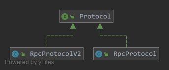

### 协议对象

* 协议由`Protocol`接口定义，该接口定义了在bolt中，一个私有协议该有的几个元素：编解码器、心跳处理器、协议命令处理器、协议命令工厂及其创建的协议命令。
```java
public interface Protocol {

    CommandEncoder getEncoder();

    CommandDecoder getDecoder();

    HeartbeatTrigger getHeartbeatTrigger();

    CommandHandler getCommandHandler();

    CommandFactory getCommandFactory();
}
```

   

* 每种协议由一个`ProtocolCode`来标识，并注册到一个协议管理器中，`ProtocolCode`只是对一个`byte[]`对象的包装：
```java
public class ProtocolManager {

    private static final ConcurrentMap<ProtocolCode, Protocol> protocols = new ConcurrentHashMap<ProtocolCode, Protocol>();

    public static Protocol getProtocol(ProtocolCode protocolCode) {
        return protocols.get(protocolCode);
    }

    // 以ProtocolCode为key，将协议对象注册到map中
    public static void registerProtocol(Protocol protocol, byte... protocolCodeBytes) {
        registerProtocol(protocol, ProtocolCode.fromBytes(protocolCodeBytes));
    }

    public static void registerProtocol(Protocol protocol, ProtocolCode protocolCode) {
        if (null == protocolCode || null == protocol) {
            throw new RuntimeException("Protocol: " + protocol + " and protocol code:" + protocolCode + " should not be null!");
        }
        Protocol exists = ProtocolManager.protocols.putIfAbsent(protocolCode, protocol);
        if (exists != null) {
            throw new RuntimeException("Protocol for code: " + protocolCode + " already exists!");
        }
    }

    public static Protocol unRegisterProtocol(byte protocolCode) {
        return ProtocolManager.protocols.remove(ProtocolCode.fromBytes(protocolCode));
    }
}
```
* bolt的rpc协议中，已经实现了两种协议：`RpcProtocol`和`RpcProtocolV2`，并由`RpcProtocolManager`注册到`ProtocolManager`中：
```java
public class RpcProtocolManager {
    public static final int DEFAULT_PROTOCOL_CODE_LENGTH = 1;

    public static void initProtocols() {
        ProtocolManager.registerProtocol(new RpcProtocol(), RpcProtocol.PROTOCOL_CODE);
        ProtocolManager.registerProtocol(new RpcProtocolV2(), RpcProtocolV2.PROTOCOL_CODE);
    }
}
```

V1版本的协议`RpcProtocol`：
```java
public class RpcProtocol implements Protocol {
    // 协议标识码
    public static final byte PROTOCOL_CODE       = (byte) 1;
    // 请求和响应的头部长度
    private static final int REQUEST_HEADER_LEN  = 22;
    private static final int RESPONSE_HEADER_LEN = 20;
    private CommandEncoder   encoder;
    private CommandDecoder   decoder;
    private HeartbeatTrigger heartbeatTrigger;
    private CommandHandler   commandHandler;
    private CommandFactory   commandFactory;

    public RpcProtocol() {
        this.encoder = new RpcCommandEncoder();
        this.decoder = new RpcCommandDecoder();
        this.commandFactory = new RpcCommandFactory();
        this.heartbeatTrigger = new RpcHeartbeatTrigger(this.commandFactory);
        this.commandHandler = new RpcCommandHandler(this.commandFactory);
    }
}
```
```text
Request command protocol for v1
0     1     2           4           6           8          10           12          14         16
+-----+-----+-----+-----+-----+-----+-----+-----+-----+-----+-----+-----+-----+-----+-----+-----+
|proto| type| cmdcode   |ver2 |   requestId           |codec|        timeout        |  classLen |
+-----------+-----------+-----------+-----------+-----------+-----------+-----------+-----------+
|headerLen  | contentLen            |                             ... ...                       |
+-----------+-----------+-----------+                                                                                               +
|               className + header  + content  bytes                                            |
+                                                                                               +
|                               ... ...                                                         |
+-----------------------------------------------------------------------------------------------+

proto: code for protocol
type: request/response/request oneway
cmdcode: code for remoting command
ver2:version for remoting command
requestId: id of request
codec: code for codec
headerLen: length of header
contentLen: length of content

Response command protocol for v1
0     1     2     3     4           6           8          10           12          14         16
+-----+-----+-----+-----+-----+-----+-----+-----+-----+-----+-----+-----+-----+-----+-----+-----+
|proto| type| cmdcode   |ver2 |   requestId           |codec|respstatus |  classLen |headerLen  |
+-----------+-----------+-----------+-----------+-----------+-----------+-----------+-----------+
| contentLen            |                  ... ...                                              |
+-----------------------+                                                                       +
|                         className + header  + content  bytes                                  |
+                                                                                               +
|                               ... ...                                                         |
+-----------------------------------------------------------------------------------------------+
respstatus: response status
 ```