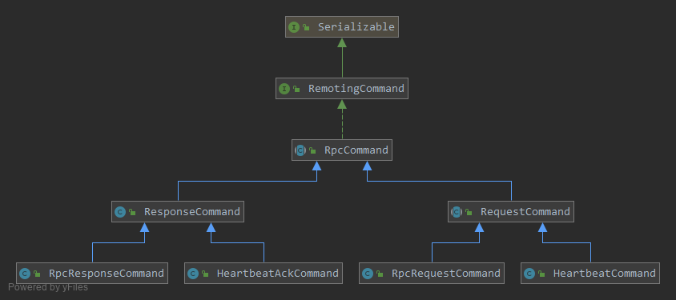
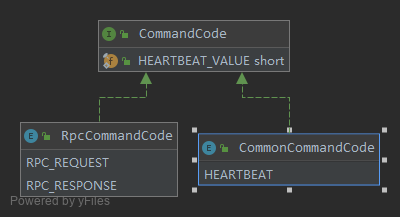

### 协议命令

* 协议命令`RemotingCommand`包含了进行网络通信的负载，以及协议中的部分头部。

   

* 如上图，命令有不同的类型，由`CommandCode`中的一个`short`类型的值区分

   

* `CommandFactory`用于构建不同类型的`RemotingCommand`，它的一个默认实现类是`RpcCommandFactory`：
```java
public interface CommandFactory {

    <T extends RemotingCommand> T createRequestCommand(final Object requestObject);

    <T extends RemotingCommand> T createResponse(final Object responseObject, RemotingCommand requestCmd);

    <T extends RemotingCommand> T createExceptionResponse(int id, String errMsg);

    <T extends RemotingCommand> T createExceptionResponse(int id, final Throwable t, String errMsg);

    <T extends RemotingCommand> T createExceptionResponse(int id, ResponseStatus status);

    <T extends RemotingCommand> T createExceptionResponse(int id, ResponseStatus status, final Throwable t);

    <T extends RemotingCommand> T createTimeoutResponse(final InetSocketAddress address);

    <T extends RemotingCommand> T createSendFailedResponse(final InetSocketAddress address, Throwable throwable);

    <T extends RemotingCommand> T createConnectionClosedResponse(final InetSocketAddress address, String message);
}
```